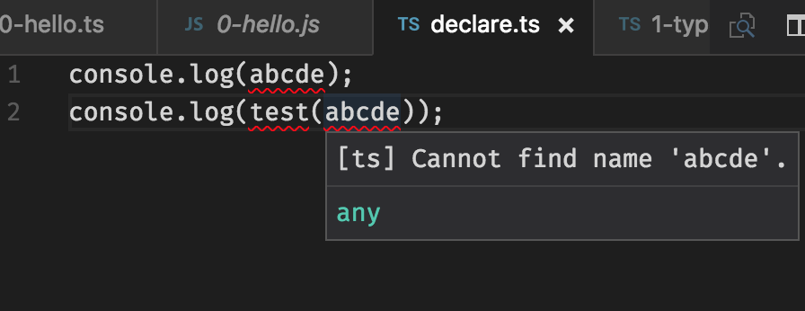
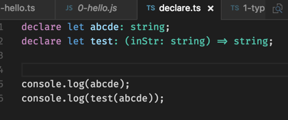
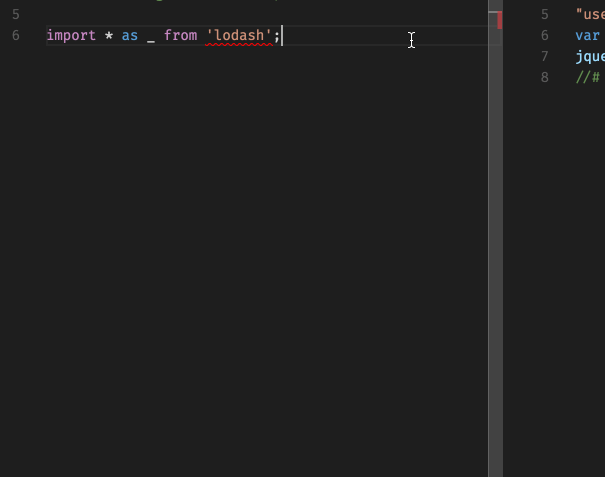

<!--
title: VS Code 中的自动完成
date: 2016-11-01 22:59:22
tags: 编辑器,vscode
-->

`vscode` `1.6.x` 发布了，有一系列的新特性，我个人比较开心见到 `ts/js` [语法着色](https://code.visualstudio.com/updates#_preview-typescript-javascript-grammar)有提升，我还专门搞了个 [issue](https://github.com/Microsoft/vscode/issues/12362)  吐槽过这个。
当然今天不是扯 `vscode` 的更新节奏很快的梗，而是扒一扒它的*自动完成*，[上一篇文章](http://jiangyuan.me/blog/2016/09/24/vscode/)已经介绍过，*自动完成*和 `typings` 紧密相关。

<!-- more -->

`typings` [官网](https://github.com/typings/typings)描述：
>The TypeScript Definition Manager.

显然是要扯到 `typescript` 了，有些哥们发誓说这辈子都不用 `typescript` ，忍一忍，一会就要说到 `js` 了。

## Typescript Definition
`Typescript Definition` 是啥？[官网](http://definitelytyped.org/) 上也没瞧出个所以然来，不了解 `ts` 显然不能理解这鬼。这个时候就该我出场了。
随意搞点 `ts` 的代码：

报错了，设置严格一点，甚至编译不会通过。想象下如果 `abcde` 是第三方库如 `jQuery` 等就尴尬了。


如上图，简单地 `declare` 下就能解决这个问题，这个过程可以称作 `define` ,将上述 `declare` 代码抽到一个 `.d.ts` 结尾的文件中单独维护，这个文件叫**声明文件(declaration file)**，也可以称之为 `definition` 。
报错的问题解决了，现在有新的问题，一大堆第三方库的 `definition` 怎样维护更新？怎样查找安装？

## 管理 definition
最早的一款工具叫 [tsd](https://github.com/DefinitelyTyped/tsd) ，因为它只能安装[全局类型声明](https://my.oschina.net/fenying/blog/747184)，于是就被抛弃了。
这个时候我们的 `typings` 隆重登场，它可以解决几乎所有 `definition` 的问题，唯一蛋疼的地方是要安装一下，以及各种奇怪的命令行参数。
`ts 2.0` 之后，可以用 `npm` 来管理 `definition` ，你只需这样：

```bash
npm install @types/jquery -S
```

详情可以参阅[这篇文章](http://blog.miniasp.com/post/2016/08/22/TypeScript-Future-Declaration-Files.aspx)。

## VS Code 中的 `definition`
`definition` 的作用当然远不止给 `ts` 本身来用，编辑器可以利用它来做非常强大的代码提示。
下图就是安装 `definition` 之前和之后的效果。



`definition` 当然在其他编辑器中也有类似的实现，但体验没有哪个能比得上 `vscode` 。

## 参考文章
* https://github.com/typings/typings
* https://github.com/typings/typings/issues/72
* https://github.com/DefinitelyTyped/DefinitelyTyped
* https://github.com/DefinitelyTyped/tsd
* http://stackoverflow.com/questions/39907142/what-is-definitelytyped
* https://my.oschina.net/fenying/blog/748805
* http://blog.miniasp.com/post/2016/08/22/TypeScript-Future-Declaration-Files.aspx
