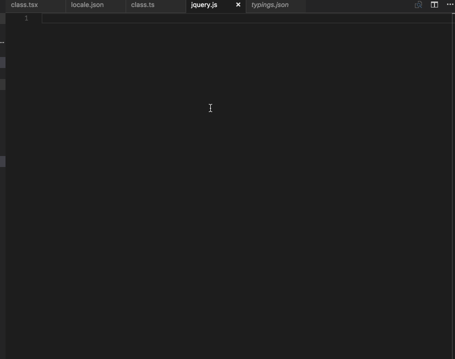

<!--meta
title: VS Code 初上手
date: 2016-09-24 22:59:22
tags: 编辑器,vscode
-->

这是《小江品评编辑器》系列的开篇，当然想开个好头。
我 2012 年开始接触前端，从最开始的记事本，到 `Dreamweaver` ，到 `notepad++` ，到风头一时无两的 `Sublime Text` ，到现在社区庞大的 `Atom`，都使用过很长一段时间。
期间也抽空玩耍过 `Vim`、`Emac`和 `Brackets` 等等，觉得智商不够浅尝辄止。
当然也不会放过 `IDE` ，`Eclispe`、`NetBeans` 、`Aptana` 都试过，现在专注 `jetbrains` 三十年、`Webstorm` 脑残粉……别胡思乱想了，我买了 `license`。
扯这么多就是为了证明，**品评编辑器**，我还真有这个资格。
今天要说的编辑器不是 `Sublime` ，她很棒，但更新太缓慢，在这个各种技术井喷的时代，再不奋起直追，只会被淘汰。
也不是 `Atom` ，他一样棒，意外的是启动时间要一个世纪。
`Webstorm` 当然是压轴登场。
今天聊聊 `VS Code` ，上镇楼图！

<!-- more -->

* [官网](https://code.visualstudio.com/)
* [插件](https://marketplace.visualstudio.com/)，当然，`code` 内置的插件管理是所有编辑器里面最好用的（上图的图标那一列就我安装的插件），几乎不会访问这个站点
* [Github](https://github.com/Microsoft/vscode)

我从 `0.x.x` 时代就开始关注，除了 `autocomplete` 和 `node debug` 的噱头，连代码折叠的功能都没有。到现在，当前版本 `1.5.3` ，终于有了些王者的样子，你值得拥有。

## 语言
这里说的不是 `js` 啊 `css` 这种语言，而是 `Chinese` `Eglish` 这种语言。很难相信你安装完成后，菜单栏、状态栏等等你能看到的一切全都是中文！
当然你可以说这是第一个官方完整支持中文的编辑器，但我还是劝你**使用英文版本**，否则你会像下面一样尴尬。

## 终端
应该是 `1.4.0` 加的特性，就是这个特性甩了 `Atom` `Sublime` 等几条街，和前端开发之神 `Webstorm` 打成平手，这份荣耀，前无古人。

## 代码提示
代码提示，`Visual Studio` 敢说第二，没人敢说第一。
`VS Code` 传承了这个特点，其体验甚至超过了 `Webstorm` ！颤抖吧！

注意两点：

* [jsconfig.json](https://code.visualstudio.com/docs/languages/jsconfig)
* [typings](https://github.com/typings/typings)

## node debug
体验没有 `Webstorm` 好，但足以秒杀其他编辑器！

## 插件
无脑安装，无须像 `Sublime` 一样折腾。
当然，必须要贴下我安装的自己。

