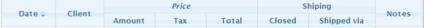
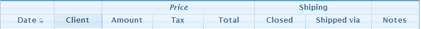

# jqGrid 之 表头分组

在列头之上可以添加一行，用来给列分组，就是表头分组。这个功能在 Excel 中再常见不过。

jqGrid 支持两种分组方式： colSpan 和非 colSpan 。

无图无真相——

colSpan



非 colSpan



可见，两者的区别主要是体现在不参与分组的列上。

## 使用限制

* 表头排序和列分组冲突，两者选其一。

* 选中列(Column Chooser) 也和列分组冲突。


## 如何使用

当表格初始化完成后，调用方法 setGroupHeaders 来给列分组，如下：

```js
$( "#grid" ).jqGrid( "setGroupHeaders", {
    useColSpanStyle: true, 
    groupHeaders: [
        { startColumnName: "id", numberOfColumns: 2, titleText: "第一组" },
        { startColumnName: "state", numberOfColumns: 2, titleText: "第二组" }
    ]
});
```

### 参数解析

调用 setGroupHeaders 会创建分组，创建分组之后，该方法的参数会被存储到 jqGrid 的参数中，
名为 groupHeader，可以通过 getGridParam 方法来获取。
相对的，调用 destroyGroupHeader 方法后，默认情况下会删除这个 groupHeader 。

参数列表：

<table>
    <tr>
        <th>属性名</th>
        <th>类型</th>
        <th>详情</th>
        <th>默认值</th>
    </tr>
    <tr>
        <td>useColSpanStyle</td>
        <td>布尔值</td>
        <td>是用 colSpan 模式还是用 nonColSpan 模式。</td>
        <td>false</td>
    </tr>
    <tr>
        <td>groupHeaders</td>
        <td>数组</td>
        <td>该数组的元素是对象，用来描述分组的相关规则以及文本。详见下表。</td>
        <td>空</td>
    </tr>
</table>

groupHeaders 中元素详细：
<table>
    <tr>
        <th>属性名</th>
        <th>类型</th>
        <th>详情</th>
    </tr>
    <tr>
        <td>startColumnName</td>
        <td>字符串</td>
        <td>
            分组的开始。值都是来自 colModel 中的 name ，表示对应列。<br />
            隐藏列忽略。
        </td>
    </tr>
    <tr>
        <td>numberOfColumns</td>
        <td>整数</td>
        <td>
            分组的列数，即多少列分为一组。 <br />
            隐藏列忽略，但是会计数。
        </td>
    </tr>
    <tr>
        <td>titleText</td>
        <td>字符串</td>
        <td>分组的标题字符。可以包含 html 标签。</td>
    </tr>
</table>


### 取消分组

通过 destroyGroupHeader 来撤销分组，将表格还原到原始状态。

```js
$( "#grid" ).jqGrid( "destroyGroupHeader" );
```

该方法带有一个布尔类型的参数，默认为 true ，你可以设为 false ：

```js
$( "#grid" ).jqGrid( "destroyGroupHeader", false );
```

分组仍旧被撤销，但是上面说得的　groupHeader 属性不会被删除，
再次创建分组时就可以使用这个 groupHeader 来替代具体的参数了。

